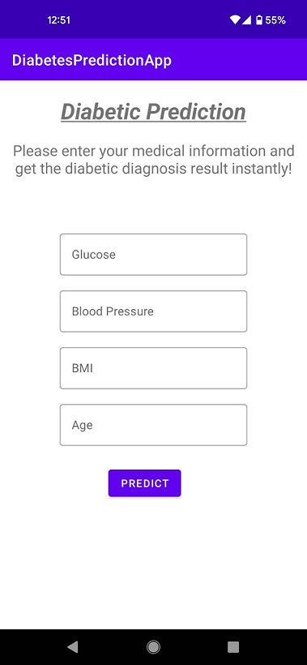
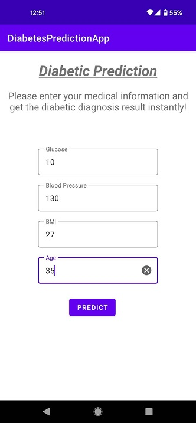
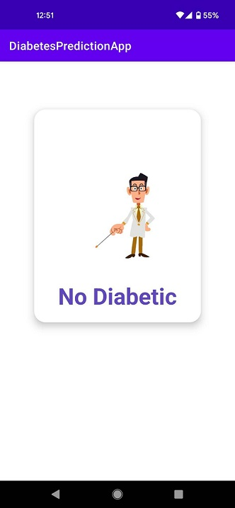

# Diabetic Prediction Android App

This repository contains the projects files of the Diabetic Prediction Android APP.

The main motto of this project was to deploy simple Deep Learning models on any Android Studio Projects 

Here are some samples of the APP interface:  

